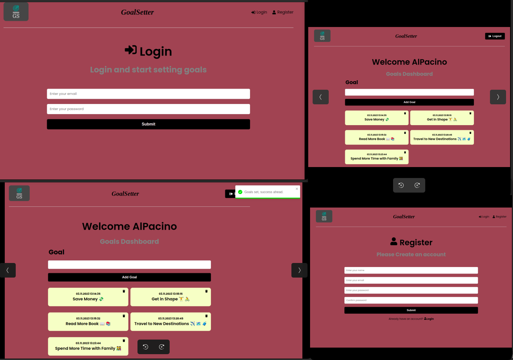

# Goal Setter Mern Stack App 



This project is part of my MERN Stack portfolio. It is a simple GoalSetter App that uses RTK Query.
You can see it in action at [https://www...com](https://www...com)

## Table of Contents
- [Features](#features)
- [Usage](#usage)
- [Installation](#installation)
- [Environment Variables](#environment-variables)
- [Run the Application](#run-the-application)
- [License](#license)

### Features
<a name="features"></a>
- User registration and login.
- Create new goals with a title and timestamp.
- View a list of all your set goals.
- Delete goals that you no longer want to track.
- Easy-to-use and user-friendly interface.
- User authentication for secure goal management.
- Clean and intuitive design.
- Responsive layout for mobile and desktop.
- Built with MERN stack (MongoDB, Express, React, Node.js).
- Utilizes Redux Toolkit and RTK Query for state management.

### Usage
<a name="usage"></a>

1. Create a MongoDB database and obtain your MongoDB URI from [MongoDB Atlas](https://www.mongodb.com/cloud/atlas).

2. Set the following environment variables:


### Environment Variables
<a name="environment-variables"></a>
```bash
NODE_ENV = development
PORT = 5000
MONGO_URI = your mongodb uri
JWT_SECRET = 'abc123'

```

### Installation
<a name="installation"></a>
3. Install Dependencies (frontend & backend):

```bash
npm install
cd frontend
npm install
```

### Run the Application
<a name="run-the-application"></a>

```bash
# Run frontend (:3000) & backend (:5000)
npm run dev

# Run backend only
npm run server

```


5. BUILD & DEPLOY
```bash
# Create frontend prod build
cd frontend
npm run build
```

### License
<a name="license"></a>
This project is licensed under the MIT License

The MIT License is a permissive open-source license that allows you to:

- Use, modify, and distribute this code in your projects.
- Include this code in both open-source and proprietary (closed-source) projects.
- Use this code for personal or commercial purposes.
- Provide attribution, but it is not required.

This means you have the freedom to use and build upon this project.


